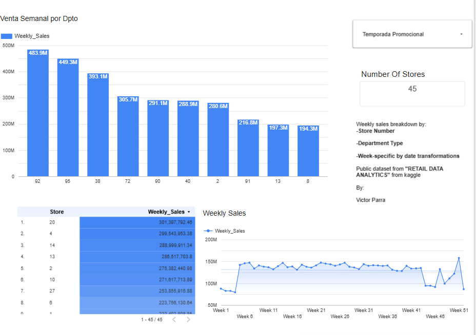

# 🛒 Retail Analytics Dashboard
Retail Data Analytics dashboard in LOOKER STUDIO
**Live Dashboard:** [View on Looker Studio](https://datastudio.google.com/reporting/1dc74e6f-5f8c-4ad8-b72b-32bcc0d29530)

---

## Overview

Interactive sales dashboard built on the **Retail Data Analytics** public dataset from Kaggle. It analyzes weekly sales performance across **45 stores** and multiple departments, with promotional season filtering.

---

## What It Shows

- **Venta Semanal por Dpto** — Weekly sales ranked by department, identifying top revenue contributors (Dept 92, 95, and 38 leading at 483M, 449M, and 393M respectively)
- **Weekly Sales Trend** — Time-series view across all 52 weeks showing seasonality patterns and a notable spike near Week 47–51 (holiday season)
- **Store Ranking Table** — All 45 stores ranked by total weekly sales, with Store 20 at the top (~$301M)
- **Promotional Season Filter** — Sliceable by promotional period to compare sales behavior during and outside promotional windows

---

## Key Insights

- Top 3 departments (92, 95, 38) account for a disproportionate share of total sales
- Clear seasonality visible in the weekly trend — a significant sales spike occurs in Q4
- Store-level variance is substantial, with the top store generating ~35% more than the median

---

## Dataset

- **Source:** [Retail Data Analytics — Kaggle](https://www.kaggle.com/datasets/manjeetsingh/retaildataset)
- **Scope:** 45 stores, department-level weekly sales, promotional flags
- **Fields used:** Store, Department, Weekly_Sales, Date, IsHoliday

---

## Tools

| Tool | Purpose |
|------|---------|
| Looker Studio (Google Data Studio) | Dashboard & visualization |
| Google Sheets | Data source connection |
| Kaggle | Public dataset |

---

## Author

**Victor Parra** — Senior Data Analyst & Mechatronics Engineer  
📊 Focused on operational analytics in manufacturing and retail environments
